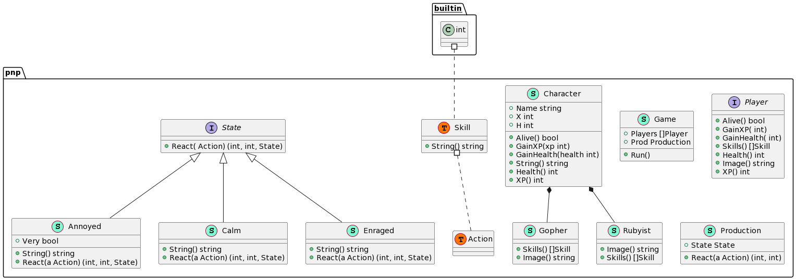

# A path to OOD with Go - Workshop
# https://github.com/ronna-s/go-ood/
This workshop is aimed to clarify the OOP features that Go provides.
It is named A Path to OOD and not OOP because different language features mean different design concepts.  

## Schedule

- 09:00-09:10: Introduction to Object-Oriented Programming [link](#introduction-to-object-oriented-programming)
- 09:10-09:30: Exercise 1- understanding the benefits [link](#exercise-1---understanding-the-benefits)
- 09:30-09:50: Object Oriented Fundamentals and Go [link](#oo-fundamentals-and-go)
  - Recap - messaging, bundling data and functions
  - Is inheritance fundamental to OOP?
    - What is it?
    - Is it fundamental?
  - Is late binding fundamental to OOP?
    - What is it?
    - Is it fundamental?
  - Are interfaces fundamental to  
    <details>

    - Defining types
    - Aliases
    - Methods - receivers, pointer receivers
    - Interfaces
    - Embedding
    - Composition
    - Type assertions 
    </details>
- 09:50-10:00: Break
- 10:00-10:30: Exercise 2 (interfaces) [link](#exercise-2---interfaces)
- 10:30-10:50: Organizing your packages [link](#organizing-your-packages) 
  <details>

  - Inner packages
  - Package `internal`
  </details>
- 10:50-11:00: Break
- 11:00-11:20: More theory [link](#more-theorye)
  <details>

  - Emerging patterns
    - functional options
    - Default variables
  - Short-lived objects, contexts
  - Code generation, why? When?
    - The `[]T{}` to `interface{}...` conversion problem
  </details>
- 11:30-11:50: Generics [link](#generics)
  <details>

  - Constraints
    - any 
    - comparable
    - the [constraints package](https://pkg.go.dev/golang.org/x/exp/constraints)
  </details>
- 11:50-12:00: Break
- 12:00-12:45: Exercise 3 (generics) [link](#exercise-3---generics)
- 12:45-13:00: Conclusion [link](#conclusion)

## Introduction to Object-Oriented Programming

#### What is OOP?<hr>
What we can all agree on: The central idea behind Object-Oriented is to divide software into "things" or "objects" or "instances" that communicate via "messages" or "methods" or "member functions".
Or in short, combining data and functionality.
This core idea has not changed in the 4-5+ decades since it was conceptualized.
It is meant to allow the developer to build code and separate responsibilities or concerns just like in the real world which is what we are familiar with and how we generally think and solve problems.

It is important to know that in most OOP languages: 
- Objects are instances of a class because only classes can define methods (that's how we support messaging).
- Classes have constructor methods that allow for safe instantiation of objects.
- Classes can inherit methods and fields from other classes as well as override them and sometimes overload them.
- In case of overriding and overloading methods, the method that will eventually run is decided at runtime. This is called late binding.

#### Is Go an Object-Oriented language?<hr>
Go doesn't offer classes, which means there are no constructors (or destructors) and no inheritance, etc.
There is also no late or late late or late late late binding in Go (but there's something else, we'll get to that).
These are technical concepts that have become synonymous with Object-Oriented Programming.
Go does have a variety of very strong features for Object-Oriented Programming that enable Gophers to express their code in a manner that follows the OO principals.
In the end, the answer to the question is Go an OOP language depends on the answer to the question "is t an object" in this [sample code](https://go.dev/play/p/ZfWFad7-TyM)

```go
package main

import "fmt"

type MyThing int //Creates a new type MyThing with an underlying type int

// Foo is now a method of my MyThing, in many languages to have a method you have to have a class or a struct
func (t MyThing) Foo() int {
	return int(t)
}
func main() {
	var t MyThing = 1
	fmt.Println(t.Foo()) // Q: is t an object?
}
```

Whether you think t is an object or not, no gopher is complete without all the tools in the gopher toolbox so let's get (re)acquainted with them.   
 
#### Do you need OOP?<hr>
Just like in the real world, wherever there are things, there can be a mess. *__That's why Marie Kondo.__*
Just as you can write insane procedural code, you can write sane OO code. You and your team should define best practices that match your needs.
This workshop is meant to give you the tools to make better design choices. 

## Exercise 1 - Understanding the benefits:
Where we will understand some OO basics using an example of a gopher and a maze.

*This exercise is heavily inspired by the Intro to CS first home assignment that [Prof. Jeff Rosenschein](https://scholar.google.com/citations?user=YO7cKNMAAAAJ&hl=en) gave my Intro to CS class in 2003.

To get a sense of what strong OOP can do for us, solve a maze given a Gopher that can perform 4 actions:
```go
// Gopher is an interface to an object that can move around a maze
type Gopher interface {
	Finished() bool // Has the Gopher reached the target cell?
	Move() error    // The Gopher moves one step in its current direction
	TurnLeft()      // The Gopher will turn left
	TurnRight()     // The Gopher will turn right
}
```

Find the function `SolveMaze(g Gopher)` in cmd/maze/maze.go and implement it, then run:
```bash
make build
make test-maze
````

When your test passes (it only tests basic navigation), run:
```bash
make run-maze > tmp/maze.html 
```

Open tmp/maze.html file in your browser to see the results of your code.
You can run the app multiple times to see your gopher running through different mazes.

Done? If not, don't worry. You have the entire conference ;) 

Let's review the code that made this possible and examine the Go features it uses.

Run
```bash
make godoc
```
The repo started with one package in the pkg directory called maze which offers a basic maze generator and nothing else.
Go to: http://127.0.0.1:8080/pkg/github.com/ronnas/go-ood/pkg/maze

The package defines 5 types:
1. Cell - an alias type to int
2. Coords - a new type defined as a pair of integers (an array of 2 ints)
3. Direction - an alias type to int
4. Maze - a generated 2D maze that is a struct
5. Wall - a struct that holds 2 neighboring cells

We see that:
1. There are no constructors in Go (since there are no classes), but we can create functions that serve as constructors.
2. The godoc tool identified our constructor function New and added it under the Maze type.
3. We have structs they can  have fields.
4. You can define a new type out of any underlying type
5. Any type can have methods (except for primitives)
6. You can alias to any type
7. If you want to add methods to primitives, just define a new type with the desired primitive underlying type
8. Methods are added to types using Receivers
9. Methods that can change/mutate the value of the type needs a pointer receiver.

Navigate around to see the travel package, then the robot package and finally the main package in `cmd/maze`

That package defines the interface that abstracted away our `robot.Robot` struct into the `Gopher` interface. This is not common.

The common OOP languages approach is that class A must inherit from class B or implement interface I in order to be used as an instance of B or I,
but our Robot type has no idea that Gopher type even exists. Gopher is defined in a completely different package that is not imported by robot.
Go was written for the 21st century and allows you to plug-in types into your code from anywhere on the internet so long that they have the correct method signatures. 
This is done in scripting languages with duck-typing, but in Go it's just type-safe, and you get compile time validation of your code.
Implicit interfaces mean that packages don't have to provide interfaces to the user, the user can define their own interface with the smallest subset of functionality that they need.
In fact our `robot.Robot` has another public method `Steps` that is not part of the `Gopher` interface because we don't need to use it.
This makes plugging-in code and defining and mocking dependencies safely a natural thing in Go and makes the code minimal to its usage.  

>_The problem with object-oriented languages is they've got all this implicit environment that they carry around with them. You wanted a banana but what you got was a gorilla holding the banana and the entire jungle._
(Joe Armstrong)

What did he mean by that?

He likely meant that OO is overcomplicated but in reality those rules that we discussed that apply to common OOP languages cause this complication:

The class Banana will have to extend or inherit from Fruit (or a similar Object class) to be considered a fruit, implement a Holdable interface just in case we ever want it to be held, implement a GrowsOnTree just in case we need to know where it came from. etc.
What happens if the Banana we imported doesn't implement an interface that we need it to like holdable? We have to write a new implementation of Banana that wraps the original Banana. 

## OO fundamentals and Go

### Composition vs. Inheritance

In Go we don't have inheritance. To express that A is I we use interfaces. To express that A is made of B or composed of B we use embedding like so:

```go

type A int //Creates a new type A with an underlying type int

// Foo is now a method of my A
func (a A) Foo() int {
	return int(a)
}

type B struct {
	// B embeds A so B now has method Foo()
	A
}

func (b B) Bar() int {
	return int(b.A)
}

type I interface {
	Foo() int
}

// to implement J we have to provide implementation for Foo() and Bar()
type J interface {
	I
	Bar() int
}

func main() {
	var b J = B{1}
	fmt.Println(b.Foo()) // 1 
	// fmt.Println(b.Bar()) // 1
}
```

We see that we can embed interfaces and structs.

## Exercise 2 - Interfaces and Embedding<hr>

We are going to add 2 types of players to the game P&P - Platforms and Programmers who will attempt to take on a Production environment.
The roles that we will implement are `pnp.Gopher`, `pnp.Rubyist`.
The player roles are going to be composed of the struct `pnp.Character` for common traits like XP and Health.
Gopher and Rubyist will also need to implement their own methods for their individual Skills.

```bash
make test-pnp
make run-pnp
```


------------------------
Remember that cmd/maze created the `Gopher` interface that was implemented by the `travel.Robot` object? - implicit interfaces like that, where a type doesn't have to know about the interfaces it implements, are unfortunatley a very uncommon feature in most languages.
Go was written for the 21st century and allows you to plug-in types into your code from anywhere on the internet so long that they have the correct method signatures. This is done in scripting languages with ducktyping, but in Go it's just safe and you get compile time validation of your code.


It is incredibly powerful:
- No need to define interfaces in advance that you won't use.
- You can define interfaces on the go only for the subset of methods that you really need. `Gopher` interfaces doesn't have all the methods that `travel.Robot` has because it doesn't need them.
- 


To understands the features that Go provides over the above described for OOP we are going to compare it with two other languages: C++ and Java that are very well known for their object-oriented features.

__In C++:__<br>
✓ Classes, structs and pure virtual functions<br>
✓ Inheritance (vtable)<br>
⍻ Only classes and structs can have methods<br>
⍻ Multiple inheritance, we can express the idea that A is B and A is also C.<br>
⍻ Class A must inherit explicitly from class B to be used as an object of type B.<br>

__In Java:__<br>
✓ Classes and interfaces.<br>
✓ Inheritance (vtable)<br>
⍻ Only classes can have methods.<br>
⍻ A class can only inherit from one other class, so we cannot express the idea that A is B and A is also C.<br>
⍻ Class A must inherit explicitly from class B to be used as an object of type B.<br>
⍻ Class A must implement explicitly from interface I in order to be used as an object of type I.<br>

__In Go:__<br>
✓ Structs<br>
✓ Any new type can have methods. You can create a type out of anything - primitives, functions, structs, etc. <br>
✓ You can compose structs and interfaces using embedding and derive methods.<br>
✓ Any type can implement any interface implicitly so long as it implements its methods (primitives only implenent the empty interface which has no methods)<br>
✗ No inheritance (vtable)<br>


|                      | Java                               | C++                           | Go                      |
|----------------------|------------------------------------|-------------------------------|-------------------------|
| Classes              | yes                                | yes                           | structs                 |
| Inheritance          | yes                                | yes                           | no                      |
| Embedding            | no                                 | no                            | yes                     |
| Methods for any type | no                                 | no                            | yes                     |
| Interfaces           | explicit, only for class instances | yes, only for class instances | implicit, anything goes |

**Note:** A struct is not a class. A struct in Go is a type that has fields and like any other type can have methods.

In conclusion:<br>
In Go, we don't need to think about how a type will be used when we create it. We don't have to provide an interface for it. 
This is a limitation doesn't exist in Go. In C++ and Java you must create extra code for potential future use even if it will never happen.
What's the most common usage for those interfaces? Mocks. To allow code that imports your code to test their code while abstracting away its dependencies you must provide interfaces. Not in Go.
When we provide a package, whoever is importing it can write their own interfaces that interact with our types.
They can reduce the interface that they will create only to the functionality they use.
This concept is made for the internet - any piece of software can be plugged from anywhere.


[It's duck typing, but safe.
](https://research.swtch.com/interfaces)

## Exercise 2 - Interfaces

We are going to add players to the game P&P - Platforms and Programmers who will attempt to take on a production environment.
The player roles are going to be composed of the struct Character for common traits like XP and Health and will implement their own methods for their individual skills.
We are going to implement the types `pnp.Character`, `pnp.Gopher` and `pnp.Rubyist` in `pkg/pnp`:




```bash
make build
make test-pnp
make run-pnp
````

## Organizing your packages

Whether you choose the common structures with cmd, pkg, etc. you should follow certain guidelines:
1. Support multiple binaries: Your packages structure should allow compiling multiple binaries (have multiple main packages that should be easy to find).
2. Don't try to reduce the number of your imports: If you have a problem it's probably the structure and unclear responsibilities, not the amount.
3. An inner package is supposed to extend the functionality of the upper package and import it (not the other way around), for example:
   - `net/http`
   - `image/draw`
   - and the example in this repo `maze/travel`
4. We already said this, but just to be clear: A package does not provide interfaces except for those it uses for its dependencies.
5. Use godoc to see what your package looks like without the code. It helps. 
6. Keep your packages' hierarchy flat. Just like your functions, imports don't do spaghetti well. 
7. Try to adhere to open/close principals to reduce the number of changes in your code. It's a good sign if you add functionality but not change everything with every feature.
8. Your packages should be things that exist and have clear boundaries - domain and app aren't.
9. The internal package is for code that you don't want to allow to import, not for your entire application. 

## More theory

#### Emerging patterns:
1. [Functional options](https://dave.cheney.net/2014/10/17/functional-options-for-friendly-apis)
2. Default variables [net/http](https://pkg.go.dev/net/http) also in this repo - the `animal.Time` function 

#### Short Lived Objects
[Consider this conversation](https://twitter.com/matryer/status/1293504405896073218)

#### Code generation, why? When?
I like this simple explanation by (Gabriele Tomassetti)[https://tomassetti.me/code-generation/]
> _The reasons to use code generation are fundamentally four: productivity, simplification, portability, and consistency._

It's about automating a process of writing repetitive error-prone code.
Consider the simple [stringer](https://pkg.go.dev/golang.org/x/tools/cmd/stringer)
Consider [Mockery](github.com/vektra/mockery) 

Now consider [this snippet](https://go.dev/play/p/fMsIH2NHHX_X):
```go
func Yalla(i ...interface{}) {
    fmt.Println(i...)
}

func main() {
    Yalla([]int{1,2,3}...)
}
```
This code produces an error because we cannot convert slices even if the individual elements implement the expected type of the other slice.
This is a property of Go's type safety.
What we used to until recently is to generate code that converts different types of slices to the empty interface.
But recently we got generics...


## Generics

It was a long time consensus that "real gophers" don't need generics so much so that around the time the generics draft of 2020 was released, many gophers expressed that they will likely never use this feature.
Let's understand firs the point that they were trying to make.

Let's look at [this code](https://gist.github.com/Xaymar/7c82ed127c8f1def53075f414a7df153), made using C++.
We see here generic code (templates) that allows an event to add functions (listeners) to its subscribers.
Let's ignore for a second that this code adds functions, not objects and let's assume it did take in objects with the function `Handle(e Event)`. 
We don't need generics in Go to make this work because interfaces are implicit. As we saw already in C++ and object has to be aware of it's implementations, this is why to allow plugging-in of functionality we have to use generics in C++ (and in Java).

In Go this code would look something like [this](https://go.dev/play/p/Tqm_Hb0vcZb):

```go
package main

import "fmt"

type Listener interface {
	Handle(Event)
}

type Event struct {
	Lis []Listener
}

func (e *Event) Add(l Listener) {
	e.Lis = append(e.Lis, l)
}

func main() {
	var l Listener //nil
	var e Event
	e.Add(l)
	fmt.Println(e)
}
```

We didn't need generics at all!

However, there are cases in Go where we have to use generics and until recently we used code generation for.
Those cases are when the behavior is derived from the type or leaks to the type:

For example:
The linked list
```go
package main

import "fmt"

type Node[T interface{}] struct {
  Value T
  Next  *Node[T]
}

func main() {
  n1 := Node[int]{1, nil}
  n2 := Node[int]{3, &n1}
  fmt.Println(n2.Value, n2.Next.Value)
}
```
Example 2 - [Addition](https://go.dev/play/p/dmeQEVxpyAq)
```go
package main

import "fmt"

type A int

// Add takes any type with underlying type int
// We can now increment all of those enums 
func Add[T ~int](i T, j T) T { 
  return i + j
}

func main() {
  var i, j A
  fmt.Println(Add(i, j))
  fmt.Println("Hello, 世界")
}
```

Of course, you are not likely to use linked lists in your day to day, but you are likely to use:
1. Repositories per type
2. Event handlers processors per type
3. The [concurrent map in the sync package](https://pkg.go.dev/sync#Map) which uses the empty interface.
4. [The heap](https://pkg.go.dev/container/heap#example-package-IntHeap) 

## Exercise 3 - Generics
Implement a new Heap OOP style in `pkg/heap` (failing tests provided).

```bash
make build
make test-heap
make run-heap
````

## Conclusion
What we've learned today:
1. The value of OOP 
2. How to use methods for encapsulation
3. How to use interfaces for abstractions
4. How to use generics for generalization (and not abstraction)
5. To generate code otherwise
